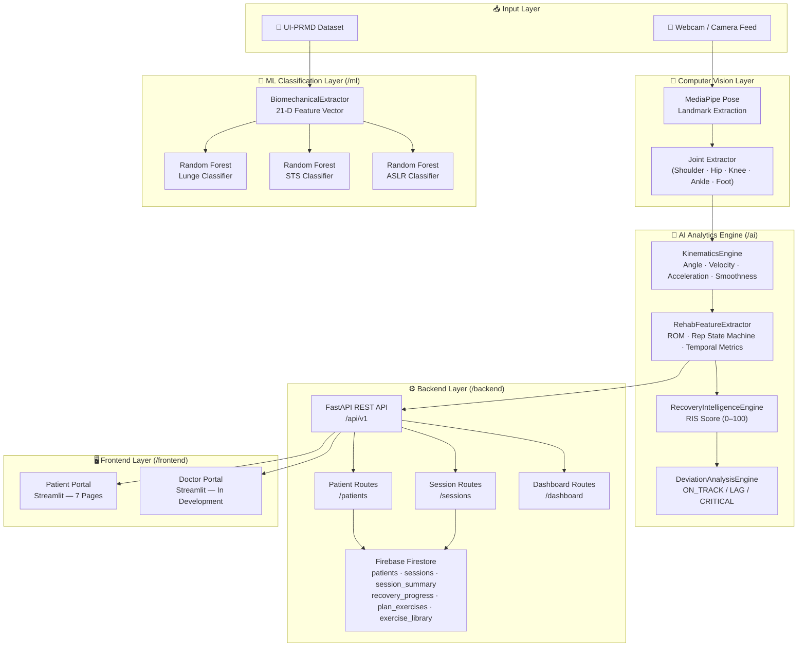
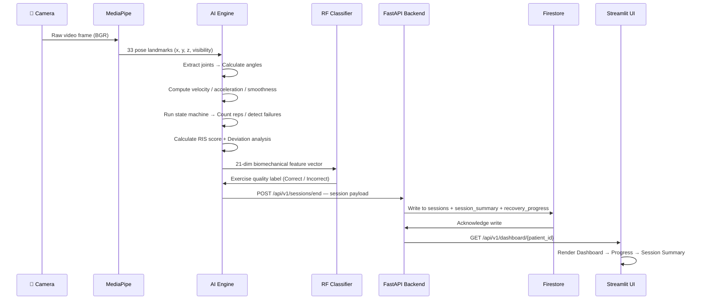
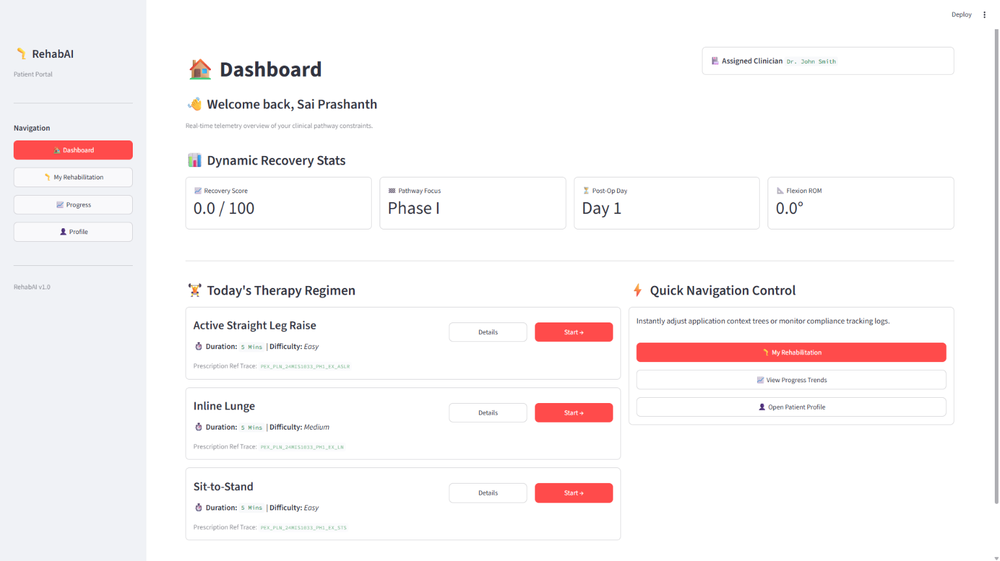
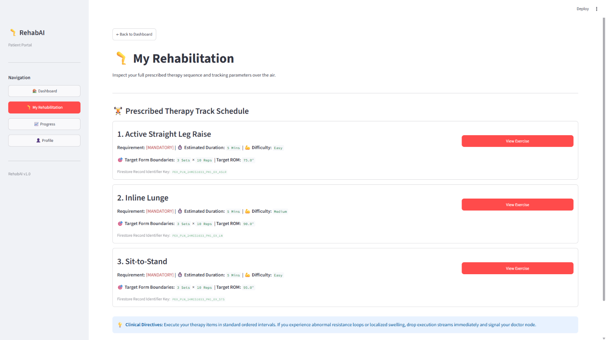
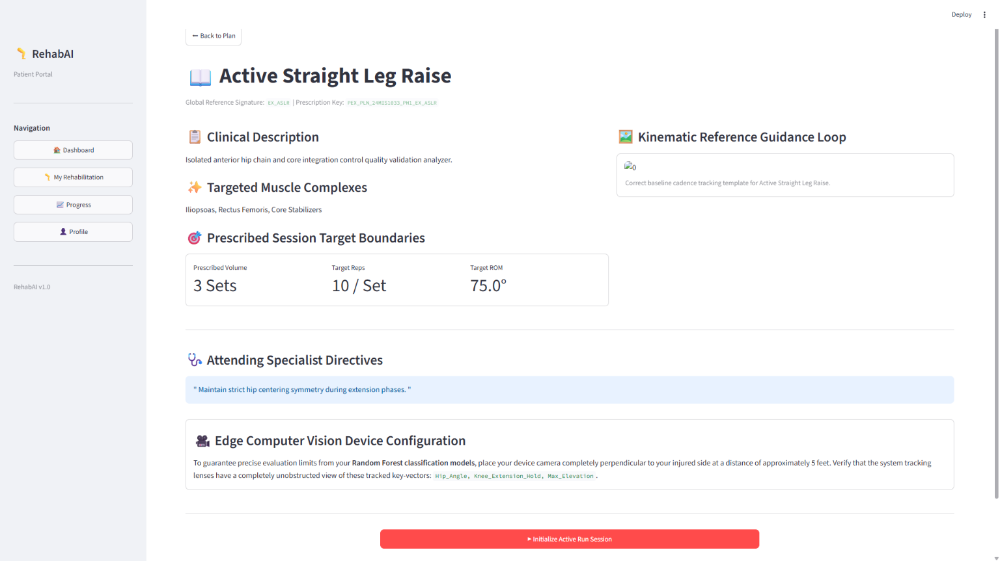
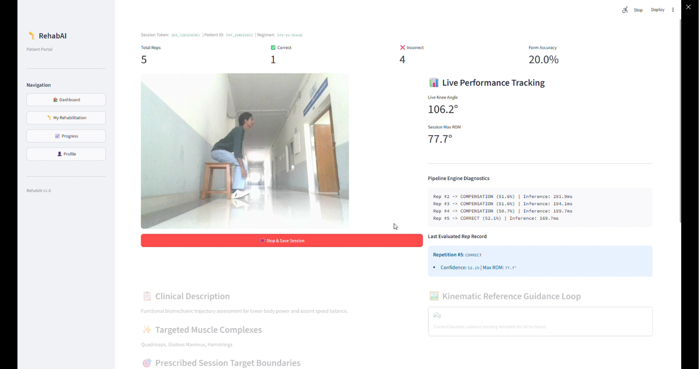
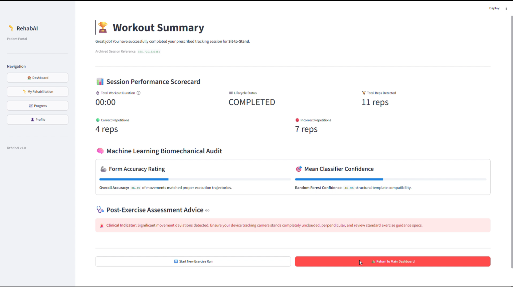

<div align="center">

<br/>

<pre>
██████╗ ███████╗██╗   ██╗ █████╗ ██████╗      █████╗ ██╗
██╔══██╗██╔════╝██║   ██║██╔══██╗██╔══██╗    ██╔══██╗██║
██████╔╝█████╗  ███████║███████║██████╔╝    ███████║██║
██╔══██╗██╔══╝  ██╔══██║██╔══██║██╔══██╗    ██╔══██║██║
██║  ██║███████╗██║   ██║██║  ██║██████╔╝    ██║  ██║██║
╚═╝  ╚═╝╚══════╝╚═╝   ╚═╝╚═╝  ╚═╝╚═════╝     ╚═╝  ╚═╝╚═╝
</pre>

# RehabAI

### *Real-time AI rehabilitation assistant powered by MediaPipe pose estimation,*
### *Random Forest exercise quality classification, and a Recovery Intelligence Score engine.*

<br/>


<br/>


-blue?style=flat-square)

<br/>

</div>

---

## 📋 Table of Contents

| Section | Description |
|---|---|
| [🧠 Overview](#-overview) | What RehabAI is and why it exists |
| [🎯 Problem Statement](#-problem-statement) | The rehabilitation gap we solve |
| [✨ Features](#-features) | Full feature breakdown |
| [🏗️ Architecture](#️-architecture) | System design & component map |
| [🔄 Workflow](#-workflow) | End-to-end data pipeline |
| [🤖 Machine Learning](#-machine-learning) | Models, dataset & results |
| [🗂️ Tech Stack](#️-tech-stack) | Full technology matrix |
| [📁 Project Structure](#-project-structure) | Folder & file layout |
| [⚙️ Installation](#️-installation) | Setup guide |
| [🚀 Usage](#-usage) | Running each component |
| [📸 Screenshots](#-screenshots) | UI & Analytics previews |
| [🗺️ Roadmap](#️-roadmap) | Future development plans |
| [📜 Acknowledgements](#-acknowledgements) | Dataset & tool credits |
| [⚖️ License](#️-license) | Legal |

---

## 🧠 Overview

**RehabAI** is a full-stack rehabilitation intelligence platform that combines **real-time computer vision**, **biomechanics-driven analysis**, and **dual-role portals** — one for patients and one for clinicians — into a single deployable system.

The system uses **Google MediaPipe Pose** to extract 3D skeletal landmarks from a standard webcam feed, processes them through a custom **Kinematics Engine** to derive biomechanical metrics, and scores each session with a custom **Recovery Intelligence Score (RIS)**. **Random Forest classifiers** trained on the **UI-PRMD** research dataset classify exercise form as Correct or Incorrect across three movement protocols — no wearables required.

> RehabAI is purpose-built for the rehabilitation workflow — bridging the gap between in-clinic supervision and data-driven at-home care.

---

## 🎯 Problem Statement

Traditional rehabilitation requires **constant in-person supervision** — expensive, geographically inaccessible, and difficult to scale. Patients exercising independently at home receive **no objective feedback** on their movement quality, form deviations, or recovery trajectory. Clinicians lack **quantitative, session-by-session data** to make evidence-based progression decisions.

**RehabAI solves this by:**
- Providing **real-time biomechanical analysis** using only a standard camera — no wearables required
- Generating a **composite Recovery Intelligence Score** per session that tracks recovery trajectory
- Giving clinicians a **data-rich dashboard** with deviation alerts, trend graphs, and patient management
- Running entirely **on commodity hardware**, making it deployable in clinics, homes, or sports facilities

---

## ✨ Features

<table>
<tr>
<td width="50%" valign="top">

### 🦴 Biomechanical Analysis Engine
Real-time multi-joint angle extraction for knee, hip, and ankle using 3D MediaPipe landmarks. Tracks Range of Motion (ROM), peak flexion/extension boundaries, and angular kinematics — all at frame rate.

</td>
<td width="50%" valign="top">

### 📐 Kinematics Pipeline
Computes angular velocity, angular acceleration, peak/average velocity, and a smoothness score using acceleration variance. A low-pass filter eliminates sub-pixel landmark jitter from raw MediaPipe output.

</td>
</tr>
<tr>
<td width="50%" valign="top">

### 🔁 Rep Intelligence & State Machine
A finite state machine tracks exercise phases (EXTENSION → FLEXION → EXTENSION), counts valid reps (duration > 1.2s threshold), detects failed/partial reps, and accumulates time-under-tension and hold duration per session.

</td>
<td width="50%" valign="top">

### 📊 Recovery Intelligence Score (RIS)
A custom composite metric (0–100) computed as a weighted sum of: mobility (ROM, 40%), movement quality (smoothness, 30%), session consistency (rep completion, 20%), and patient comfort (pain rating, 10%).

</td>
</tr>
<tr>
<td width="50%" valign="top">

### 📉 Deviation Analysis Engine
Compares today's RIS against the expected recovery trajectory and yesterday's baseline. Classifies recovery status as `ON_TRACK`, `MODERATE_LAG`, or `CRITICAL_LAG` and generates plain-language AI-assisted recommendations.

</td>
<td width="50%" valign="top">

### 🤖 Exercise Quality Classifier
Random Forest models (350 estimators, balanced class weights) trained on the UI-PRMD research dataset classify exercise form as **Correct** or **Incorrect** for Lunge, Sit-to-Stand (STS), and Active Straight Leg Raise (ASLR).

</td>
</tr>
<tr>
<td width="50%" valign="top">

### 🧑‍⚕️ Doctor Portal *(In Development)*
Clinician-facing Streamlit dashboard shell for patient management, session-level biomechanics review, recovery trend visualization, and exercise recommendation management.

</td>
<td width="50%" valign="top">

### 🧑‍💻 Patient Portal
Patient-facing Streamlit interface with seven pages: Dashboard, My Rehabilitation, Exercise Detail, Live Session, Session Summary, Progress, and Profile.

</td>
</tr>
<tr>
<td width="50%" valign="top">

### ⚡ Modular FastAPI REST Backend
REST API (FastAPI + Uvicorn) with full OpenAPI/Swagger documentation. Active routes cover patient management, session lifecycle, and dashboard analytics. Authentication and recommendation routes are planned for a future release.

</td>
<td width="50%" valign="top">

### ☁️ Firebase Firestore Persistence
Patient profiles, session records, session summaries, recovery progress, and exercise library data are persisted across six Firestore collections via `firebase_admin`.

</td>
</tr>
</table>

---

## 🏗️ Architecture



---

## 🔄 Workflow



---

## 🤖 Machine Learning

### Dataset — UI-PRMD

The **[UI-PRMD Dataset](https://www.webpages.uidaho.edu/ui-prmd/)** (University of Idaho) is a publicly available research-based dataset containing full-body motion capture recordings of patients performing 10 rehabilitation exercises. RehabAI trains binary form classifiers (Correct / Incorrect) on three protocols:

| Code | Exercise | Description |
|---|---|---|
| `m03` | Lunge | Single-leg forward lunge with knee tracking |
| `m05` | STS | Sit-to-Stand transition from a chair |
| `m06` | ASLR | Active Straight Leg Raise — hip flexor activation |

### Model Architecture

```
Input: UI-PRMD skeleton sequence (N frames × 30 joints × 3D coordinates)
  │
  ▼
Temporal Resampling → 100-frame aligned sequence
  │
  ▼
BiomechanicalExtractor → 21-dimensional feature vector
  [knee_angle, hip_angle, ankle_angle, rom, peak_flexion, peak_extension,
   angular_velocity, angular_acceleration, peak_velocity, average_velocity,
   rep_duration, hold_duration, avg_rep_time, exercise_time, rest_time,
   time_under_tension, movement_quality, movement_smoothness,
   rom_consistency, exercise_completion, limb_symmetry_index]
  │
  ▼
StandardScaler (z-score normalization)
  │
  ▼
RandomForestClassifier
  ├── n_estimators:      350
  ├── max_depth:         None (fully grown trees)
  ├── min_samples_split: 2
  ├── max_features:      sqrt
  └── class_weight:      balanced
  │
  ▼
Output: Binary label — Correct Form / Incorrect Form
```

### Evaluation Results — Cross-Subject Generalizability Analysis

> Cross-subject hold-out fold validation. Each model evaluated on subjects not seen during training.

| Exercise | Accuracy | Precision | Recall | F1 Score | Support |
|---|---|---|---|---|---|
| 🏃 Lunge | **81%** | 0.81 | 0.81 | 0.81 | 380 |
| 🪑 Sit-to-Stand (STS) | **75%** | 0.75 | 0.75 | 0.75 | 400 |
| 🦵 ASLR | **74%** | 0.74 | 0.74 | 0.74 | 400 |

**Confusion Matrices:**

| Model | TP (Correct ✓) | FP | FN | TN (Incorrect ✓) |
|---|---|---|---|---|
| Lunge | 151 | 39 | 35 | 155 |
| STS | 145 | 55 | 44 | 156 |
| ASLR | 143 | 57 | 47 | 153 |

### Recovery Intelligence Score (RIS) — Formula

$$RIS = \left[\left(\frac{ROM_{max}}{130°} \times 0.40\right) + \left(Smoothness \times 0.30\right) + \left(\frac{Reps_{done}}{Reps_{target}} \times 0.20\right) + \left(\frac{10 - Pain}{10} \times 0.10\right)\right] \times 100$$

| Component | Weight | Metric Source |
|---|---|---|
| Mobility | **40%** | Peak ROM / Target ROM (130°) |
| Movement Quality | **30%** | Acceleration variance smoothness score |
| Session Consistency | **20%** | Completed reps / Prescribed reps |
| Patient Comfort | **10%** | (10 − Pain rating) / 10 |

---

## 🗂️ Tech Stack

| Layer | Technology | Version | Role |
|---|---|---|---|
| **Pose Estimation** | MediaPipe | — | Real-time 33-keypoint body pose tracking |
| **Computer Vision** | OpenCV | — | Frame capture, image processing, HUD overlay |
| **ML Framework** | scikit-learn | — | Random Forest training, inference, evaluation |
| **Numerical Core** | NumPy / SciPy | — | Kinematics math, feature engineering |
| **Data Layer** | Pandas | — | Dataset loading, preprocessing, analysis |
| **Backend API** | FastAPI | — | REST API, OpenAPI docs, request validation |
| **ASGI Server** | Uvicorn | — | ASGI server for FastAPI |
| **Database** | Firebase Firestore | — | NoSQL cloud persistence |
| **Cloud SDK** | firebase-admin | — | Server-side Firestore access |
| **Frontend UI** | Streamlit | — | Patient & Doctor interactive dashboards |
| **Visualization** | Plotly / Matplotlib | — | Analytics charts & evaluation plots |
| **Schema Validation** | Pydantic v2 | — | API request/response models |
| **Model Persistence** | Joblib | — | RF model serialization / `.pkl` export |
| **Runtime** | Python | — | Language & interpreter |

---

## 📁 Project Structure

```
RehabAI/
│
├── 📄 main.py                         # Standalone live CV analytics loop (MediaPipe + HUD)
├── 📄 requirements_clean.txt          # Consolidated dependency manifest
│
├── 🧠 ai/                             # Edge analytics & rehabilitation intelligence
│   ├── engine.py                      # Core pipeline orchestrator
│   ├── camera_source.py               # Camera capture & frame management
│   ├── movement_engine.py             # KinematicsEngine + RehabFeatureExtractor
│   ├── movement_source.py             # Movement data source abstraction
│   ├── recovery_engine.py             # RecoveryIntelligenceEngine (RIS computation)
│   ├── deviation_engine.py            # DeviationAnalysisEngine (trajectory comparison)
│   └── predictor.py                   # RF model inference interface
│
├── ⚙️ backend/                         # FastAPI REST API layer
│   ├── api.py                         # App factory, CORS config, router registration
│   ├── config.py                      # Environment & settings (pydantic-settings)
│   ├── schemas.py                     # Pydantic v2 request/response schemas
│   ├── firebase.py                    # Firebase Admin SDK initialization
│   ├── credentials/
│   │   └── firebase_key.json          # 🔒 Service account key (not tracked in git)
│   ├── models/                        # Pydantic/ORM data models
│   ├── routes/                        # Active API route handlers
│   │   ├── patients.py                # Patient CRUD  →  /api/v1/patients
│   │   ├── sessions.py                # Session lifecycle  →  /api/v1/sessions
│   │   └── dashboard.py              # Dashboard & exercise library  →  /api/v1/dashboard
│   ├── services/                      # Business logic layer
│   └── database/                      # Firestore utilities
│
├── 🖥️ frontend/                        # Streamlit UI portals
│   ├── patient/
│   │   ├── patient.py                 # Patient portal entry point (multi-page router)
│   │   └── _pages/
│   │       ├── dashboard.py           # 🏠 Dashboard
│   │       ├── rehabilitation.py      # 💪 My Rehabilitation
│   │       ├── exercise_detail.py     # 📖 Exercise Detail
│   │       ├── live_session.py        # 🎥 Live Session (CV + ML inference)
│   │       ├── session_summary.py     # 📋 Session Summary
│   │       ├── progress.py            # 📊 Progress Dashboard
│   │       └── profile.py             # 👤 Profile
│   ├── doctor/
│   │   └── dashboard.py              # Doctor dashboard (⚠️ In Development)
│   └── common/                        # Shared UI components, services & utilities
│
├── 🌲 ml/                              # ML training, evaluation & inference
│   ├── config.py                      # Dataset paths, model dir, RF hyperparameters
│   ├── dataset_loader.py              # UI-PRMD data loader (UIPRMDLoader)
│   ├── preprocessing.py               # Temporal resampling to 100-frame sequences
│   ├── feature_extractor.py           # BiomechanicalExtractor — 21-D feature engineering
│   ├── train_models.py                # Training pipeline entry point
│   ├── evaluate_models.py             # Cross-subject evaluation & confusion matrices
│   ├── inference.py                   # Real-time inference helpers
│   ├── vis_dataset.py                 # Dataset visualization utilities
│   ├── models/                        # Serialized trained models
│   │   ├── Lunge_RF.pkl               # Lunge classifier (~1.7 MB)
│   │   ├── STS_RF.pkl                 # STS classifier (~1.7 MB)
│   │   ├── ASLR_RF.pkl                # ASLR classifier (~1.7 MB)
│   │   └── scaler.joblib              # Feature normalization scaler
│   └── evaluation_plots/              # Training evaluation output graphs
│
├── 📂 assets/                          # Documentation & media assets
│   ├── architecture/                  # System & ML architecture diagrams
│   │   ├── system_architecture.png
│   │   ├── workflow.png
│   │   └── ml_pipeline.png
│   ├── results/                       # Model evaluation charts & confusion matrices
│   │   ├── accuracy_comparison.png
│   │   ├── confusion_matrix_lunge.png
│   │   ├── confusion_matrix_sts.png
│   │   ├── confusion_matrix_aslr.png
│   │   ├── feature_importance_lunge.png
│   │   ├── feature_importance_sts.png
│   │   └── feature_importance_aslr.png
│   ├── screenshots/                   # UI interface captures
│   │   ├── dashboard.png
│   │   ├── my_rehabilitation.png
│   │   ├── exercise_details.png
│   │   ├── live_session.png
│   │   ├── session_summary.png
│   │   └── progress_dashboard.png
│   └── demo/                          # Workflow GIF & demo video
│       ├── workflow.gif
│       └── demo.mp4
│
└── 🔬 UI-PRMD-Analysis-master/         # Raw clinical dataset (not tracked in git)
```

---

## ⚙️ Installation

**Prerequisites:** Python 3.11+, Git, webcam, Firebase project with Firestore enabled.

### 1. Clone

```bash
git clone https://github.com/your-username/RehabAI.git
cd RehabAI
```

### 2. Virtual Environment

```bash
python -m venv .venv

# Windows
.\.venv\Scripts\activate

# macOS / Linux
source .venv/bin/activate
```

### 3. Install Dependencies

```bash
pip install -r requirements_clean.txt
```

> **Note:** If MediaPipe fails to install automatically, run `pip install mediapipe` separately.

### 4. Firebase Setup

1. Create a project at [console.firebase.google.com](https://console.firebase.google.com)
2. Enable **Firestore** in Native mode
3. Download a **Service Account Key** (JSON) from Project Settings → Service Accounts
4. Save it to `backend/credentials/firebase_key.json`
5. Create `.env` in the project root:

```env
FIREBASE_KEY_PATH=backend/credentials/firebase_key.json
SECRET_KEY=your-jwt-secret-key
```

### 5. (Optional) Retrain Models

Pre-trained `.pkl` files are included under `ml/models/`. To retrain from the UI-PRMD dataset:

```bash
python -m ml.train_models
```

---

## 🚀 Usage

### 🔴 Live CV Analytics Loop

```bash
python main.py
```

> Stand in front of your webcam. The system detects pose, extracts biomechanical features, and overlays joint angles and rep counts. Press **`q`** to quit.

### ⚙️ Start the FastAPI Backend

```bash
uvicorn backend.api:app --reload --host 0.0.0.0 --port 8000
```

| Endpoint | URL |
|---|---|
| 📖 Swagger UI (API Docs) | http://127.0.0.1:8000/docs |
| 📄 ReDoc | http://127.0.0.1:8000/redoc |
| 💚 Health Check | http://127.0.0.1:8000/health |

**Active API routes** (prefix: `/api/v1`):

| Route | Methods | Description |
|---|---|---|
| `/api/v1/patients` | GET, POST | List / create patient profiles |
| `/api/v1/patients/{id}` | GET, PUT, DELETE | Read / update / remove patient |
| `/api/v1/patients/{id}/recovery` | PATCH | Push CV-derived recovery metrics |
| `/api/v1/sessions/start` | POST | Initialize a new rehabilitation session |
| `/api/v1/sessions/end` | POST | Finalize session, write summary & recovery data |
| `/api/v1/sessions/{session_id}` | GET | Retrieve session summary |
| `/api/v1/dashboard/{patient_id}` | GET | Fetch exercise plan for patient dashboard |
| `/api/v1/dashboard/exercise-library/{code}` | GET | Fetch exercise metadata from library |

### 🧑‍💻 Launch Patient Portal

```bash
streamlit run frontend/patient/patient.py
```

### 🧑‍⚕️ Launch Doctor Portal

```bash
streamlit run frontend/doctor/dashboard.py
```

### 🌲 Train ML Models

```bash
python -m ml.train_models
```

### 📊 Evaluate Models

```bash
python -m ml.evaluate_models
```

> Outputs per-exercise classification reports and confusion matrices to the console, and saves evaluation plots to `ml/evaluation_plots/`.

---

## 📸 Screenshots

> 📷 Screenshots will be added here once captured. Replace image paths with actual captures from the running application.

| View | Preview |
|---|---|
| 🏠 **Patient Dashboard** |  |
| 💪 **My Rehabilitation** |  |
| 📖 **Exercise Details** |  |
| 🎥 **Live Session** |  |
| 📋 **Session Summary** |  |
| 📊 **Progress Dashboard** |  |

---

## 🗺️ Roadmap

| Priority | Feature | Description |
|---|---|---|
| 🔴 High | **SPARC-Based Smoothness** | Replace variance-based smoothness with SPARC (Spectral Arc Length) — a clinically validated movement quality metric |
| 🔴 High | **LSTM / Transformer Classifier** | Replace Random Forest with a temporal sequence model for improved cross-subject generalizability |
| 🟡 Medium | **Doctor Portal — Full Implementation** | Complete clinical dashboard with patient list, session review, and recommendation management |
| 🟡 Medium | **Limb Symmetry Index (LSI)** | Contralateral limb tracking for bilateral symmetry analysis |
| 🟡 Medium | **Auto-Generated Session Reports** | PDF session summaries with biomechanics charts, RIS trend, and recovery insights |
| 🟡 Medium | **Pain-Adaptive Difficulty** | Dynamically adjust exercise prescription based on patient-reported pain and RIS trajectory |
| 🟢 Low | **Mobile App (iOS / Android)** | Native mobile client for at-home patient sessions |
| 🟢 Low | **Voice / Audio Feedback** | Real-time spoken guidance during exercise |
| 🟢 Low | **Wearable Sensor Fusion** | IMU/EMG data fusion with computer vision for higher-precision kinematics |
| 🟢 Low | **Telehealth Integration** | Remote therapist live session observation and annotation |

---

## 📜 Acknowledgements

- **Centre for Wireless System Design (C-WiSD), Anna University** — For hosting the Summer Internship on Machine Learning and Artificial Intelligence under which RehabAI was developed.
- **Department of Biomedical Engineering, Anna University** — For domain guidance and academic context during the internship.
- **Vakanski et al., University of Idaho** — Authors and maintainers of the [UI-PRMD Dataset](https://www.webpages.uidaho.edu/ui-prmd/) that underpins the exercise quality classifiers.
- **Google MediaPipe** — Open-source [Pose Landmarker](https://developers.google.com/mediapipe/solutions/vision/pose_landmarker) enabling markerless real-time body tracking.
- **FastAPI, Streamlit & Firebase** — Open-source and cloud infrastructure powering the backend, UI, and data layer.

---

## ⚖️ License

```
Copyright © 2026 RehabAI. All Rights Reserved.

This software and its source code are proprietary and confidential.
Unauthorized copying, distribution, modification, or use of this
software, in whole or in part, is strictly prohibited without the
express prior written permission of the copyright holder.
```

---

<div align="center">

*Built with ❤️ for the future of accessible, intelligent rehabilitation.*

*RehabAI — Bringing research-based biomechanics analysis to every camera-equipped device.*

</div>
