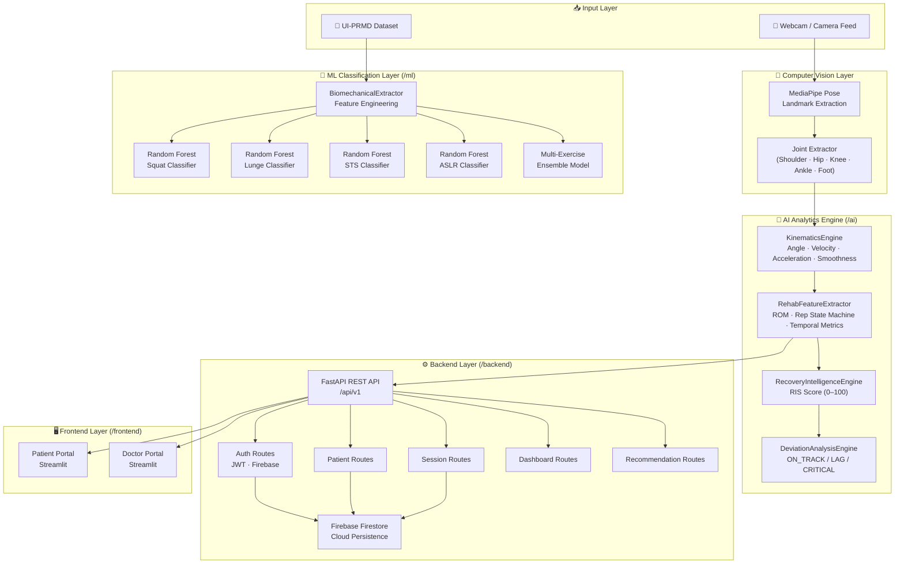
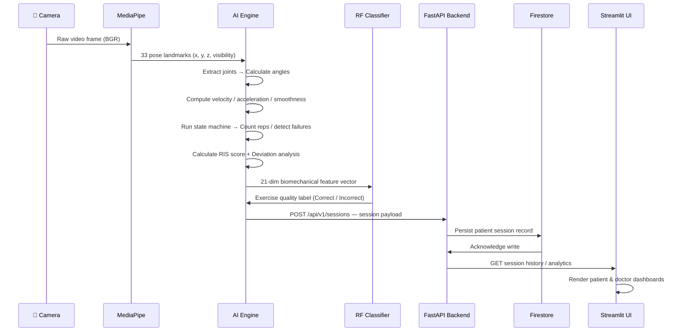

<div align="center">

<br/>

<pre>
██████╗ ███████╗██╗   ██╗ █████╗ ██████╗      █████╗ ██╗
██╔══██╗██╔════╝██║   ██║██╔══██╗██╔══██╗    ██╔══██╗██║
██████╔╝█████╗  ███████║███████║██████╔╝    ███████║██║
██╔══██╗██╔══╝  ██╔══██║██╔══██║██╔══██╗    ██╔══██║██║
██║  ██║███████╗██║   ██║██║  ██║██████╔╝    ██║  ██║██║
╚═╝  ╚═╝╚══════╝╚═╝   ╚═╝╚═╝  ╚═╝╚═════╝     ╚═╝  ╚═╝╚═╝
</pre>

# RehabAI

### *Real-time AI rehabilitation assistant powered by MediaPipe pose estimation,*
### *Random Forest exercise quality classification, and a Recovery Intelligence Score engine.*

<br/>


<br/>


-blue?style=flat-square)

<br/>

</div>

---

## 📋 Table of Contents

| Section | Description |
|---|---|
| [🧠 Overview](#-overview) | What RehabAI is and why it exists |
| [🎯 Problem Statement](#-problem-statement) | The rehabilitation gap we solve |
| [✨ Features](#-features) | Full feature breakdown |
| [🏗️ Architecture](#️-architecture) | System design & component map |
| [🔄 Workflow](#-workflow) | End-to-end data pipeline |
| [🤖 Machine Learning](#-machine-learning) | Models, dataset & results |
| [🗂️ Tech Stack](#️-tech-stack) | Full technology matrix |
| [📁 Project Structure](#-project-structure) | Folder & file layout |
| [⚙️ Installation](#️-installation) | Setup guide |
| [🚀 Usage](#-usage) | Running each component |
| [📸 Screenshots](#-screenshots) | UI & Analytics previews |
| [🗺️ Roadmap](#️-roadmap) | Future development plans |
| [⚖️ License](#️-license) | Legal |

---

## 🧠 Overview

**RehabAI** is a full-stack, hybrid rehabilitation intelligence platform that combines **real-time computer vision**, **clinical-grade biomechanics analysis**, and **dual-role portals** — one for patients and one for clinicians — into a single, deployable system.

At its core, RehabAI uses **Google MediaPipe Pose** to extract 3D skeletal landmarks from a standard webcam feed, processes them through a custom **Kinematics Engine** to derive biomechanical metrics, and scores each session using a custom **Recovery Intelligence Score (RIS)**. A suite of **Random Forest classifiers** trained on the **UI-PRMD** clinical dataset further classifies exercise form as correct or incorrect across four movement protocols.

> Unlike fragmented academic tools or consumer fitness apps, RehabAI is purpose-built for the clinical rehabilitation workflow — bridging the gap between in-clinic supervision and data-driven at-home care.

---

## 🎯 Problem Statement

Traditional rehabilitation requires **constant in-person supervision** — expensive, geographically inaccessible, and difficult to scale. Patients exercising independently at home receive **no objective feedback** on their movement quality, form deviations, or recovery trajectory. Clinicians lack **quantitative, session-by-session data** to make evidence-based progression decisions.

**RehabAI solves this by:**
- Providing **real-time biomechanical analysis** using only a standard camera — no wearables required
- Generating a **composite Recovery Intelligence Score** per session that tracks clinical recovery trajectory
- Giving clinicians a **data-rich dashboard** with deviation alerts, trend graphs, and patient management
- Running entirely **on commodity hardware**, making it deployable in clinics, homes, or sports facilities

---

## ✨ Features

<table>
<tr>
<td width="50%" valign="top">

### 🦴 Biomechanical Analysis Engine
Real-time multi-joint angle extraction for knee, hip, and ankle using 3D MediaPipe landmarks. Tracks Range of Motion (ROM), peak flexion/extension boundaries, and angular kinematics — all at frame rate.

</td>
<td width="50%" valign="top">

### 📐 Kinematics Pipeline
Computes angular velocity, angular acceleration, peak/average velocity, and a smoothness score using acceleration variance. A low-pass filter eliminates sub-pixel landmark jitter from raw MediaPipe output.

</td>
</tr>
<tr>
<td width="50%" valign="top">

### 🔁 Rep Intelligence & State Machine
A finite state machine tracks exercise phases (EXTENSION → FLEXION → EXTENSION), counts valid reps (duration > 1.2s threshold), detects failed/partial reps, and accumulates time-under-tension and hold duration per session.

</td>
<td width="50%" valign="top">

### 📊 Recovery Intelligence Score (RIS)
A custom composite metric (0–100) computed as a weighted sum of: mobility (ROM, 40%), movement quality (smoothness, 30%), session consistency (rep completion, 20%), and patient comfort (pain rating, 10%).

</td>
</tr>
<tr>
<td width="50%" valign="top">

### 📉 Deviation Analysis Engine
Compares today's RIS against the expected recovery trajectory and yesterday's baseline. Classifies recovery status as `ON_TRACK`, `MODERATE_LAG`, or `CRITICAL_LAG` and generates clinical recommendations accordingly.

</td>
<td width="50%" valign="top">

### 🤖 Exercise Quality Classifier
Random Forest models (350 estimators, balanced class weights) trained on the UI-PRMD clinical dataset classify exercise form as **Correct** or **Incorrect** for Squat, Lunge, Sit-to-Stand (STS), and Active Straight Leg Raise (ASLR).

</td>
</tr>
<tr>
<td width="50%" valign="top">

### 🧑‍⚕️ Doctor Portal
Clinician-facing Streamlit dashboard for patient management, session-level biomechanics review, recovery trend visualization, and exercise recommendation management — accessible remotely, asynchronously.

</td>
<td width="50%" valign="top">

### 🧑‍💻 Patient Portal
Patient-facing Streamlit interface for session history, exercise tracking, progress visualization, and personalized feedback — designed for non-technical users with guided UX.

</td>
</tr>
<tr>
<td width="50%" valign="top">

### ⚡ FastAPI REST Backend
Production-grade REST API (FastAPI + Uvicorn) with full OpenAPI/Swagger documentation. Routes cover authentication, patient management, session CRUD, dashboard analytics, exercise prescriptions, and clinical recommendations.

</td>
<td width="50%" valign="top">

### ☁️ Firebase Firestore Persistence
All patient profiles, session records, and analytics data are persisted to **Google Cloud Firestore** via `firebase_admin`. JWT-based authentication secures all API endpoints via PyJWT.

</td>
</tr>
</table>

---

## 🏗️ Architecture



---

## 🔄 Workflow



---

## 🤖 Machine Learning

### Dataset — UI-PRMD

The **University of Idaho Physical Rehabilitation Movements Dataset (UI-PRMD)** is a publicly available clinical-grade dataset containing full-body motion capture recordings of patients performing 10 rehabilitation exercises. RehabAI uses **three movement protocols** for binary form classification (Correct / Incorrect):

| Code | Exercise | Description |
| --- | --- | --- |
| `m03` | Lunge | Single-leg forward lunge with knee tracking |
| `m05` | STS | Sit-to-Stand transition from a chair |
| `m06` | ASLR | Active Straight Leg Raise — hip flexor activation |

> The Squat model and multi-exercise ensemble are trained independently using the full feature extraction pipeline.

### Model Architecture

```
Input: UI-PRMD skeleton sequence (N frames × 30 joints × 3D coordinates)
  │
  ▼
Temporal Resampling → 100-frame aligned sequence
  │
  ▼
BiomechanicalExtractor → Engineered feature vector
  │
  ▼
StandardScaler (z-score normalization)
  │
  ▼
RandomForestClassifier
  ├── n_estimators:      350
  ├── max_depth:         None (fully grown trees)
  ├── min_samples_split: 2
  ├── max_features:      sqrt
  └── class_weight:      balanced
  │
  ▼
Output: Binary label — Correct Form / Incorrect Form

```

### Evaluation Results — Cross-Subject Generalizability Analysis

> Evaluation methodology: Cross-subject hold-out fold validation. Each model evaluated on unseen subjects.

**Confusion Matrices:**

| Model | TP (Correct ✓) | FP | FN | TN (Incorrect ✓) |
| --- | --- | --- | --- | --- |
| Lunge | 151 | 39 | 35 | 155 |
| STS | 145 | 55 | 44 | 156 |
| ASLR | 143 | 57 | 47 | 153 |

### Recovery Intelligence Score (RIS) — Formula

$$RIS = \left[\left(\frac{ROM_{max}}{130°} \times 0.40\right) + \left(Smoothness \times 0.30\right) + \left(\frac{Reps_{done}}{Reps_{target}} \times 0.20\right) + \left(\frac{10 - Pain}{10} \times 0.10\right)\right] \times 100$$

| Component | Weight | Metric Source |
| --- | --- | --- |
| Mobility | **40%** | Peak ROM / Target ROM (130°) |
| Movement Quality | **30%** | Acceleration variance smoothness score |
| Session Consistency | **20%** | Completed reps / Prescribed reps |
| Patient Comfort | **10%** | (10 − Pain rating) / 10 |

---

## 🗂️ Tech Stack

| Layer | Technology | Version | Role |
| --- | --- | --- | --- |
| **Pose Estimation** | MediaPipe | Latest | Real-time 33-keypoint body pose tracking |
| **Computer Vision** | OpenCV | 4.10.0 | Frame capture, image processing, HUD overlay |
| **ML Framework** | scikit-learn | 1.9.0 | Random Forest training, inference, evaluation |
| **Numerical Core** | NumPy / SciPy | 1.26 / 1.17 | Kinematics math, feature engineering |
| **Data Layer** | Pandas | 3.0.3 | Dataset loading, preprocessing, analysis |
| **Backend API** | FastAPI | 0.138 | REST API, OpenAPI docs, request validation |
| **ASGI Server** | Uvicorn | 0.49 | Production ASGI server for FastAPI |
| **Auth** | PyJWT | 2.13 | JWT token generation & verification |
| **Database** | Firebase Firestore | 2.28 | NoSQL cloud persistence |
| **Cloud SDK** | firebase-admin | 7.4 | Server-side Firestore + Storage access |
| **Frontend UI** | Streamlit | 1.58 | Patient & Doctor interactive dashboards |
| **Visualization** | Plotly / Matplotlib | 6.8 / 3.11 | Analytics charts & training evaluation plots |
| **Schema Validation** | Pydantic v2 | 2.13 | API request/response models |
| **Model Persistence** | Joblib | 1.5 | RF model serialization / `.pkl` export |
| **Runtime** | Python | 3.11+ | Language & interpreter |

---

## 📁 Project Structure

```
RehabAI/
│
├── 📄 main.py                        # Standalone live CV analytics loop (MediaPipe + HUD)
├── 📄 requirements_clean.txt          # Consolidated dependency manifest
│
├── 🧠 ai/                            # Edge analytics & rehabilitation intelligence
│   ├── engine.py                     # Core pipeline orchestrator
│   ├── camera_source.py              # Camera capture & frame management
│   ├── movement_engine.py            # KinematicsEngine + RehabFeatureExtractor
│   ├── movement_source.py            # Movement data source abstraction
│   ├── recovery_engine.py            # RecoveryIntelligenceEngine (RIS computation)
│   ├── deviation_engine.py           # DeviationAnalysisEngine (trajectory comparison)
│   └── predictor.py                  # RF model inference interface
│
├── ⚙️ backend/                        # FastAPI REST API layer
│   ├── api.py                        # App factory, CORS config, router registration
│   ├── config.py                     # Environment & settings management
│   ├── schemas.py                    # Pydantic v2 request/response schemas
│   ├── firebase.py                   # Firebase Admin SDK initialization
│   ├── credentials/
│   │   └── firebase_key.json         # 🔒 Service account key (not tracked in git)
│   ├── models/                       # ORM / data models
│   ├── routes/                       # API route handlers
│   │   ├── auth.py                   # Authentication endpoints
│   │   ├── patients.py               # Patient CRUD operations
│   │   ├── sessions.py               # Session management & retrieval
│   │   ├── dashboard.py              # Aggregated dashboard data endpoints
│   │   ├── doctors.py                # Doctor-specific endpoints
│   │   ├── exercises.py              # Exercise prescription management
│   │   ├── recommendations.py        # Clinical recommendation routes
│   │   └── analytics.py              # Analytics & reporting endpoints
│   ├── services/                     # Business logic layer
│   └── database/                     # Database utilities & connections
│
├── 🖥️ frontend/                        # Streamlit UI portals
│   ├── patient/
│   │   └── patient.py                # Patient portal entry point
│   ├── doctor/
│   │   ├── dashboard.py              # Doctor main dashboard
│   │   └── _pages/                   # Doctor sub-page modules
│   └── common/                       # Shared UI components & utilities
│
├── 🌲 ml/                             # ML training, evaluation & inference
│   ├── config.py                     # Dataset paths, model dir, RF hyperparameters
│   ├── dataset_loader.py             # UI-PRMD data loader & parser (UIPRMDLoader)
│   ├── preprocessing.py              # Temporal resampling utilities
│   ├── feature_extractor.py          # BiomechanicalExtractor — feature engineering
│   ├── train_models.py               # Training pipeline entry point
│   ├── evaluate_models.py            # Cross-subject evaluation with confusion matrices
│   ├── inference.py                  # Real-time inference helpers
│   ├── vis_dataset.py                # Dataset visualization utilities
│   ├── models/                       # Serialized trained models
│   │   ├── squat_rf.pkl              # Squat classifier (~14 MB)
│   │   ├── Lunge_RF.pkl              # Lunge classifier (~1.7 MB)
│   │   ├── STS_RF.pkl                # STS classifier (~1.7 MB)
│   │   ├── ASLR_RF.pkl               # ASLR classifier (~1.7 MB)
│   │   ├── multi_exercise_rf.pkl     # Multi-exercise ensemble (~51 MB)
│   │   └── scaler.joblib             # Feature normalization scaler
│   └── evaluation_plots/             # Training evaluation output graphs
│
└── 🔬 UI-PRMD-Analysis-master/        # Raw clinical dataset (not tracked in git)

```

---

## ⚙️ Installation

### Prerequisites

* **Python 3.11+** (tested on 3.11.x)
* **Git**
* A **webcam** for live pose tracking
* A valid **Firebase project** with Firestore enabled

### 1. Clone the Repository

```bash
git clone [https://github.com/your-username/RehabAI.git](https://github.com/your-username/RehabAI.git)
cd RehabAI

```

### 2. Create a Virtual Environment

```bash
python -m venv .venv

# Windows
.\.venv\Scripts\activate

# macOS / Linux
source .venv/bin/activate

```

### 3. Install Dependencies

**Option A — Consolidated (recommended):**

```bash
pip install -r requirements_clean.txt

```

**Option B — Per-module:**

```bash
pip install -r backend/requirements.txt
pip install -r frontend/requirements.txt

```

> **Note:** MediaPipe is included in `requirements_clean.txt`. On some systems you may need to install it separately: `pip install mediapipe`

### 4. Configure Firebase

1. Create a Firebase project at [console.firebase.google.com](https://console.firebase.google.com)
2. Enable **Firestore** in Native mode
3. Generate a **Service Account Key** (JSON) from Project Settings → Service Accounts
4. Save it to:
```
backend/credentials/firebase_key.json

```


5. Create a `.env` file in the project root:
```env
FIREBASE_KEY_PATH=backend/credentials/firebase_key.json
SECRET_KEY=your-jwt-secret-key

```


### 5. (Optional) Download Dataset & Train Models

To retrain models from scratch, download the **UI-PRMD dataset** and place it at `UI-PRMD-Analysis-master/data/`. Then run:

```bash
python -m ml.train_models

```

Pre-trained `.pkl` files are already included under `ml/models/`.

---

## 🚀 Usage

### 🔴 Live CV Analytics Loop

Runs the standalone real-time pose tracking pipeline with HUD overlay. No backend required.

```bash
python main.py

```

> Stand in front of your webcam. The system will detect your pose, extract biomechanical features in real-time, and display joint angles and rep counts on-screen. Press **`q`** to quit.

### ⚙️ Start the FastAPI Backend

```bash
uvicorn backend.api:app --reload --host 0.0.0.0 --port 8000

```

| Endpoint | URL |
| --- | --- |
| 📖 Swagger UI (API Docs) | http://127.0.0.1:8000/docs |
| 📄 ReDoc | http://127.0.0.1:8000/redoc |
| 💚 Health Check | http://127.0.0.1:8000/health |

### 🧑‍💻 Launch Patient Portal

```bash
streamlit run frontend/patient/patient.py

```

### 🧑‍⚕️ Launch Doctor Portal

```bash
streamlit run frontend/doctor/dashboard.py

```

### 🌲 Train ML Models

```bash
python -m ml.train_models

```

### 📊 Evaluate Models

```bash
python -m ml.evaluate_models

```

> Outputs per-exercise classification reports and confusion matrices to the console, and saves evaluation plots to `ml/evaluation_plots/`.

---

## 📸 Screenshots

> 📷 **Screenshots coming soon** — UI captures of the patient portal, doctor dashboard, and live CV overlay will be added here.

---

## 🗺️ Roadmap

The following improvements are planned for future versions of RehabAI:

| Priority | Feature | Description |
| --- | --- | --- |
| 🔴 High | **SPARC-Based Smoothness** | Replace variance-based smoothness with SPARC (Spectral Arc Length) — a clinically validated movement quality metric |
| 🔴 High | **LSTM / Transformer Classifier** | Replace Random Forest with a deep learning temporal sequence model for improved generalizability across unseen subjects |
| 🟡 Medium | **Limb Symmetry Index (LSI)** | Contralateral limb tracking via dual-camera or stereo setup for bilateral symmetry analysis |
| 🟡 Medium | **Auto-Generated Clinical Reports** | PDF session summaries with biomechanics charts, RIS trend, and clinical recommendations |
| 🟡 Medium | **Pain-Adaptive Difficulty** | Dynamically adjust exercise prescription based on patient-reported pain and RIS trajectory |
| 🟢 Low | **Mobile App (iOS / Android)** | Native mobile client for at-home patient sessions with camera-based pose estimation |
| 🟢 Low | **Voice / Audio Feedback** | Real-time spoken guidance for patients during exercise ("Go deeper", "Slow down", etc.) |
| 🟢 Low | **Wearable Sensor Fusion** | Fuse IMU accelerometer/gyroscope data with computer vision for higher-precision kinematics |
| 🟢 Low | **Telehealth Integration** | Real-time video session overlay allowing remote therapists to observe and annotate live sessions |

---

## 📜 Acknowledgements

* **Vakanski et al.** — Authors of the [UI-PRMD Dataset](https://www.webpages.uidaho.edu/ui-prmd/), University of Idaho. The clinical motion capture data powering RehabAI's exercise quality classifiers.
* **Google MediaPipe Team** — For the open-source [MediaPipe Pose](https://developers.google.com/mediapipe/solutions/vision/pose_landmarker) solution enabling markerless real-time biomechanics analysis without specialized hardware.
* **FastAPI** and **Streamlit** communities — For building the production-grade open-source tools that make a full-stack Python AI application possible.
* **Firebase / Google Cloud** — For scalable, serverless NoSQL persistence infrastructure via Firestore.

---

## ⚖️ License

```
Copyright © 2026 RehabAI. All Rights Reserved.

This software and its source code are proprietary and confidential.
Unauthorized copying, distribution, modification, or use of this
software, in whole or in part, is strictly prohibited without the
express prior written permission of the copyright holder.

```

---

**Built with ❤️ for the future of accessible, intelligent rehabilitation.**

*RehabAI — Bringing clinical-grade biomechanics to every camera-equipped device.*
